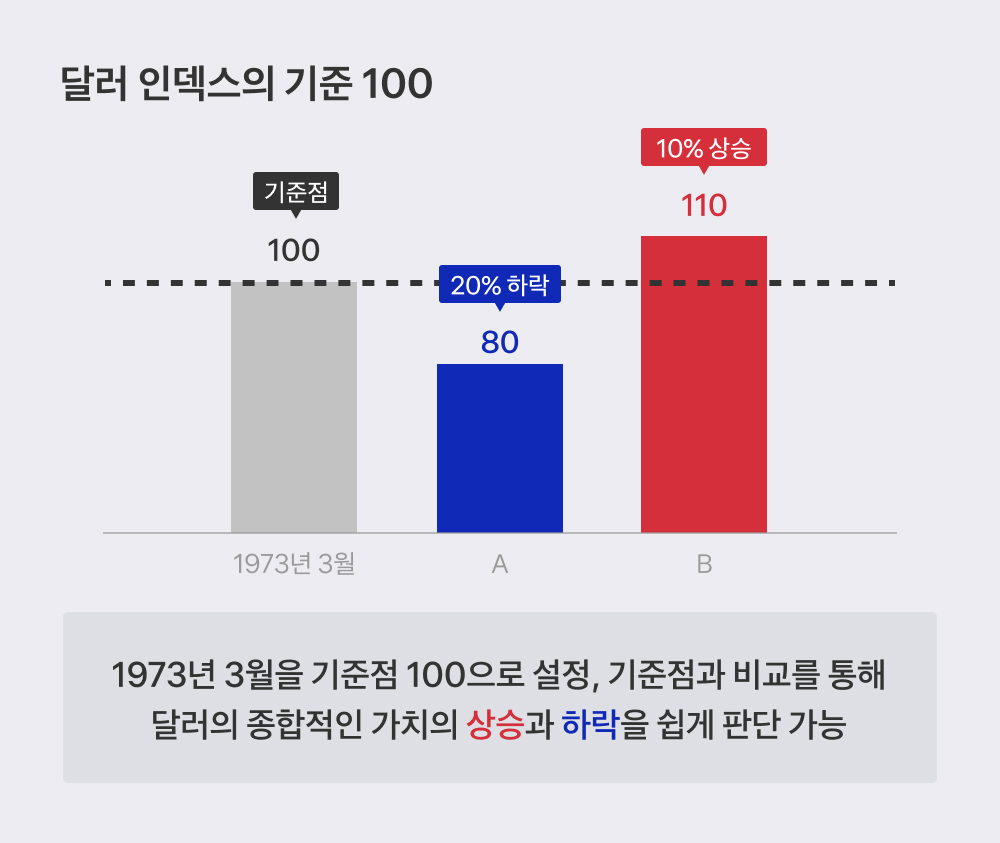

# Bitcoin Analysis Project

## Introduction

### Background

#### 1. 활용 목표

: 이번 주 수업의 주제는 웹 활용으로, 이번 주차에 배운 html상의 데이터 송수신과 DB 활용을 목표로 한다.

#### 2. 주제

: 지난 프로젝트에서 활용한 RNN 시계열 분석에 이어, 다양한 외부 변수를 고려한 비트코인 가격 예측 모델을 구축한다.

#### 3. 목표 및 방법

1. 비트코인 가격 예측 모델 구축
2. 외부 변수 탐색 및 반영
3. 정확도 향상을 위한 다양한 시도
4. 최종 모델 선정 및 예측
5. 결과 시각화 및 해석
6. 웹페이지 구축
7. DB 연동 필요

### Data

- 바이낸스 크롤링 : 문섭님
- 외부 변수 : 달러 가치, 금값, 나스닥
- 뉴스와 sns 등을 활요하면 좋겠지만 패스

### Method

- RNN
- Transformer

## 1. Data Collection

### 외부 변수 1 : 달러 가치

https://www.tossbank.com/articles/23697 : 달러 가치에 대한 설명

- 출처 : 토스뱅크

- 달러 인덱스 : 주요 6개 통화에 대한 달러 가치를 나타내는 지표
- 세계적인 경제 상황을 파악하는데 중요한 지표

#### 달러 인덱스 기준 : 1973년 3월 - 100으로 기준

#### 영향 - 환율, 금리, 수입수출품 가격

- 환율 : 달러 인덱스 상승 -> 원화 가치 하락
- 금리 : 달러 인덱스 상승 -> 미국 금리 상승
- 수입수출품 가격 : 달러 인덱스 상승 -> 수입품 가격 상승

> 데이터 출처 : https://kr.investing.com/

- DXY : 달러 인덱스 지표
- 데이터 () : 2005/04/20 ~ 2024/04/19
- 데이터 (2) : 1986/04/21 ~ 2005/04/19
- 데이터 (3) : 1979/12/26 ~ 1986/04/18

- pandas로 하나로 모으기

### 외부 변수 2 : 금값

- 금 가격의 세계적 지표 : GCM4
- 데이터 출처 : https://kr.investing.com/
- 데이터 기간은 위 날짜와 동일 (3 파일)

### 외부 변수 3 : S&P 500

- 데이터 출처 : https://kr.investing.com/

미국 대표 주가지수 : 다우존스, S&P 500, 나스닥

- 다우존스 : 총 30개 기업, 산업주 중심 (예: Boeing, Coca-Cola, IBM, McDonald's, Microsoft 등)

- 나스닥 : 총 100개 기업, 기술주 중심 (예: Apple, Amazon, Facebook, Google, Microsoft 등)

- S&P 500 : 총 500개 기업, 다우존스보다 넓은 범위 (예: Apple, Amazon, Facebook, Google, Microsoft 등)
  - 전체 주식 시장의 80%를 대표

: 출처 - KB증권

- S&P 500이 더 포괄적이기 때문에 S&P 500을 활용

- 데이터 기간은 위 날짜와 동일 (3 파일)
- 데이터 (1) (2) (3)

## 4월 20일 : 