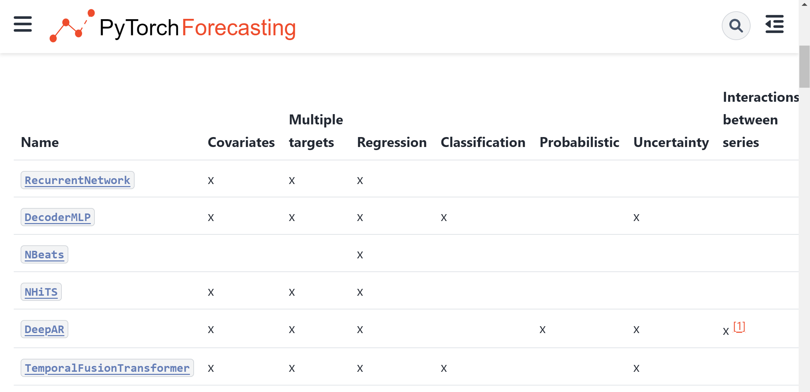
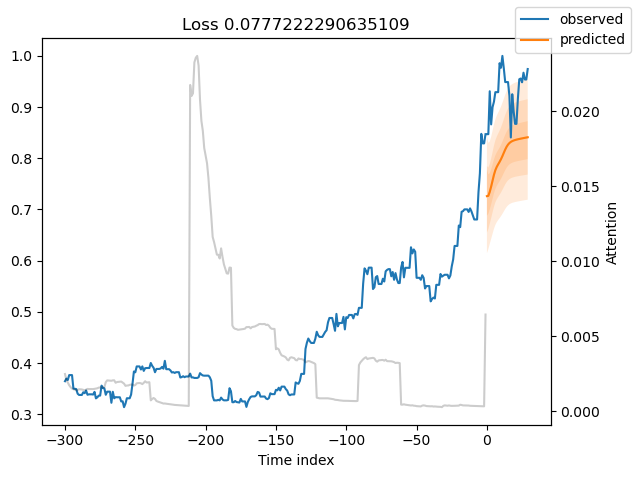

## 4월 21일 : 일요일 작업

### 할 일

[] pytorch forecast 공부 (난상 우상)
[] html 프레임 짜기 (난중 우상)
[] 데이터 모아서 시각화 - 인사이트 도출 (난중 우중)
[] DB 연동 (난최상 우중)

개인적으로 할 일
[] 리빙랩 영수증 (코파일럿) 제작 (난중하 우상)
[] 학교 연락할 내용 정하기 (난하 우중)

### 예측 관련 자료

#### 예측

이란 주어진 이용가능한 모든 정보(과거 데이터 및 예측에 영향을 끼칠 수 있는 미래 사건에 대한 지식을 포함)를 바탕으로 가능한 한 정확하게 미래를 예측하는 것입니다.  
내 예측 : 비트코인의 가격 예측

#### 목표

는 예측 및 계획과 연관되어 있는 것이 좋지만, 이것이 항상 일어나는 것은 아닙니다. 목표를 어떻게 달성할지에 대한 계획과 목표가 실현 가능한지에 대한 예측 없이 목표를 세우는 경우가 너무나도 자주 있습니다.  
목표 : 높은 정확도로 예측

#### 계획

은 예측과 목표에 대한 대응입니다. 계획은 여러분의 예측과 목표를 일치시키는데 필요한 적절한 행동을 결정하는 일을 포함합니다.  
계획 : 상승한다면 구매, 하락한다면 판매

회사의 많은 영역에서 중요한 역할을 할 수 있기 때문에, 예측은 경영에서 의사결정 행동에 있어서 중요한 요소가 되어야합니다. 현대 기업들은 특정한 용도에 따라 단기, 중기, 장기 예측을 필요로 하고 있습니다.  
중장기 요소 : 계절성(반감기), 경기변동(유가와 금리)

### 1. forecasting

- doc를 읽고 forecasting을 해보자
- prophet, ARIMA, LSTM, GRU, Transformer
- prophet : Facebook에서 개발한 시계열 예측 라이브러리
- ARIMA : AutoRegressive Integrated Moving Average
- LSTM : Long Short-Term Memory
- GRU : Gated Recurrent Unit
- Transformer : Attention is All You Need
- 여기에 MinMaxScaler가 있었다,,

  
: 모델의 종류

### 2. 모델 선택하기

: 그전에 이해가 필요

#### 1) Availability of Covariates

- 공변량의 유무
- 공변량 : 예측에 영향을 미치는 변수
- 공변량이 없으면 ARIMA, prophet
- 공변량이 있으면 LSTM, GRU, Transformer

#### 2) Length of Time Series

- 시계열의 길이
- 시계열이 짧으면 TemporalFusionTransformer
- 단기 예측에 특화
- cold-start prediction : 새로운 시계열 데이터에 대한 예측

#### Type of prediction task : 예측 작업 유형

Not every can do regression, classification or handle multiple targets. Some are exclusively geared towards a single task. For example, **NBeats** can only be used for regression on a single target without covariates while the **TemporalFusionTransformer** supports multiple targets and even hetrogeneous targets where some are continuous variables and others categorical, i.e. regression and classification at the same time. **DeepAR** can handle multiple targets but only works for regression tasks.  
For long forecast horizon forecasts, **NHiTS** is an excellent choice as it uses interpolation capabilities.

> NBits : 단일 대상 회귀
> TemporalFusionTransformer : 다중 대상, 회귀 및 분류

> 다중대상(공변량), 회귀 -> TemporalFusionTransformer

### 3. TemporalFusionTransformer

[07_forecasting_test.ipynb](../07_forecasting_test.ipynb)

#### 겨우겨우 제작 완료

  
: 왜 크게 차이나지...

#### 발표용 그래프

  
: 